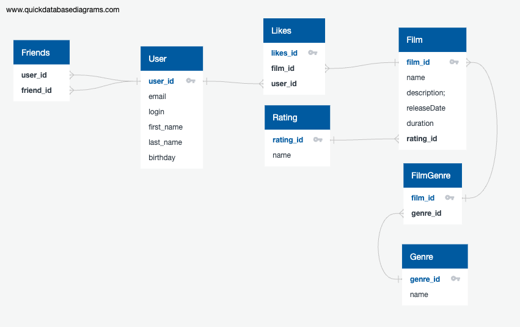

# Фильмотека

Сервис для работы с фильмами, с возможностью ставить оценки фильмам и рекомендательной системой.


Стеки: Spring Boot, SQL, PostgreSQL, Maven.



Данные разложены по 8 таблицам, 3 для класса USER, 5 для класса Film
Позволяют рабтать сполями и организацию хранения информации

Примеры запросов

```
/*
получаем информацию о пользователе, включая количество друзей,
выводим первые 15 результатов, сгруппированных по имени и фамилии
*/
SELECT u.user_id,
       u.first_name,
       u.last_name,
       u.login,
       u.email,
       u.birthday,
       COUNT(f.friends_id)
FROM User AS u
LEFT JOIN Friends AS f ON u.user_id = f.user_id
GROUP BY u.first_name
         AND u.last_name,
         u.login,
         u.email,
         u.birthday
LIMIT 15;
```
```
/*
выводим информацию о количестве друзей, имеющих статус "CONFIRMED"
*/
SELECT u.user_id,
       u.first_name,
       COUNT(friend_id)
FROM User AS u
LEFT JOIN Friends AS f ON u.user_id = f.user_id
LEFT JOIN Status AS s ON f.status_id = s.status_id
GROUP BY u.user_id,
         u.first_name,
         COUNT(friend_id)
WHERE name = 'CONFIRMED'
```
```
/*
получаем инфомацию о количестве друзей у пользователя,
при выводе информации о количестве друзей избавляемся от повтора user_id при выводе,
при выволе результат группируем по status_id и сортируем по количеству friend_id
*/

SELECT DISTINCT user_id,
       COUNT(friend_id),
FROM friends
GROUP BY user_id,
ORDER BY COUNT(friend_id);
```

```
/*
получаем данные о фильме, включая количество лайков и жанр,
групируем по уникальному идентификатору фильма,
выводим первые 15 результатов
*/
SELECT f.film_id,
       f.name,
       f.description,
       f.releaseDate,
       f.duration,
       f.mpa_id,
       fg.name, -- жанр
       COUNT(l.likes_id)
FROM Film AS f
LEFT JOIN Likes AS l ON f.film_id = l.film_id
LEFT JOIN FilmGenre AS fg ON f.film_id = fg.film_id
GROUP BY f.film_id,
         f.name,
         f.description,
         f.releaseDate,
         f.duration,
         f.rating_id,
         fg.name
LIMIT 15;
```
```
/*
выводим данные о фильме и количестве набранных им лайков,
группируем по количестсу лайков в порядке убывания,
выводим топ-10 ко количеству лайков
*/
SELECT f.name,
       COUNT(l.likes_id) as total.likes
FROM Film AS f
LEFT JOIN Likes AS l ON f.film_id = l.film_id
GROUP BY f.name
ORDER BY total.likes DESC
LIMIT 10;
```
